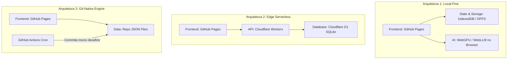

# 🧠 Brainstorm: Evolução & Arquitetura — Challenge of the Day

> **Projeto**: `project1-2026b-arthurmfroes`  
> **Contexto**: Trabalho de Cadeira de Desenvolvimento Web (UFSM)  
> **Objetivo**: Elevar o nível técnico do projeto (exigência maior por ter experiência no mercado), explorando **CI/CD com GitHub Actions**, **IA Local (< 3B parâmetros)** e **Infraestrutura Mínima / Zero-Ops** (descartando a dependência do Google Sheets/Apps Script).

---

## 🎯 Contexto e Requisitos do Projeto

### Requisitos Funcionais do Projeto (`README.md`)
1. **Cronômetro com Limite de Tempo**: Definido por desafio conforme dificuldade; ao esgotar, bloqueia submissão.
2. **Datas & Categorias**: Associação de desafios a datas específicas e separação por etiquetas/assuntos.
3. **Interface "Sem Desafio Disponível"**: Tela dedicada e informativa com a data do próximo desafio disponível.
4. **Dashboard de Desempenho do Estudante**: Contagem de desafios respondidos, histórico de acertos/erros e % de precisão.

### Desafios Técnicos Adicionais (Cobrança da Professora)
1. **CI/CD Avançado**: Usar GitHub Actions para automação, testes e deploys.
2. **IA Local (< 3B de parâmetros)**: Modelo pequeno para geração automática de desafios/perguntas.
3. **Infraestrutura Mínima (Zero-Ops)**: Manutenção próxima de zero, sem necessidade de manter VPS/servidor próprio, focando em simplicidade de execução e alta persistência.

---

## 🚀 Pilar 1: CI/CD com GitHub Actions

O GitHub Actions atuará como a espinha dorsal de automação do repositório.

### Opções de Workflows:

* **Workflow 1: CI & Validação Estática (`ci.yml`)**
  * Linting de código (HTML/CSS/JS).
  * **Validador de JSON de Desafios**: Script automático que checa se os arquivos JSON de desafios estão com o schema correto antes de permitir o merge em `main`.

* **Workflow 2: Continuous Deployment (`deploy.yml`)**
  * Deploy automatizado do frontend estático no **GitHub Pages** a cada commit/merge aprovado na branch principal.

* **Workflow 3: Automação por Cron (`challenge-generator.yml`)**
  * Um workflow agendado que executa rotinas periódicas (ex: geração ou rotação de desafios) e faz o commit dos resultados diretamente no repositório.

---

## 🤖 Pilar 2: IA Local (< 3B Parâmetros) para Geração de Desafios

Modelos leves recomendados: **SmolLM2 (1.7B)**, **Qwen 2.5 (1.5B / 3B)** ou **Llama 3.2 (1B / 3B)**.

### Estratégias de Integração:

#### Abordagem A: Client-Side via WebGPU (100% no Browser)
* **Como funciona**: Usa bibliotecas como `@mlc-ai/web-llm` ou `@huggingface/transformers`.
* **Fluxo**: Na interface do admin/gerador, o navegador baixa e executa o modelo na GPU local do usuário. O usuário informa o assunto (ex: *"CSS Grid"*), a IA gera a estrutura JSON válida e salva no sistema.
* **Vantagens**: Custo R$ 0,00 de infraestrutura, zero dependência de servidor de IA na nuvem.

#### Abordagem B: CLI / Script Local com Ollama
* **Como funciona**: Script em Node.js ou Python na pasta `scripts/` que consome o Ollama rodando na máquina de desenvolvimento (`http://localhost:11434`).
* **Fluxo**: Comando de terminal `npm run generate -- --topic "Promises JS"` gera a pergunta e atualiza a base de dados em formato JSON.

---

## 🛠️ Pilar 3: Modelos de Arquitetura de "Infra Mínima" (Sem Google Infra)

Para atender o espírito da infraestrutura mínima sem usar Google Sheets/Apps Script nem subir uma VPS própria:

---

### Arquitetura 1: Local-First (IndexedDB + WebGPU + Git Static)

* **Backend**: **Inexistente.** Todo o código roda 100% no lado do cliente.
* **Banco de Dados**: **IndexedDB + OPFS** no navegador do estudante (armazena respostas, tempo, estatísticas e progresso).
* **Desafios**: Arquivos JSON estáticos hospedados no GitHub Pages (`/data/challenges.json`).
* **IA**: WebLLM via WebGPU no navegador do administrador/professor.
* **Prós**: Custo R$ 0,00 perpétuo, funciona offline, resiliência total, zero manutenção de servidor.
* **Contras**: Dados do aluno ficam restritos ao navegador dele (pode exportar/importar via arquivo `.json`/`.csv`).

---

### Arquitetura 2: Edge Serverless (Cloudflare Workers + D1 SQLite)

* **Backend**: **Cloudflare Workers** (funções serverless com 100k req/dia grátis).
* **Banco de Dados**: **Cloudflare D1** (banco de dados SQLite gerenciado na borda, 100% grátis).
* **Deploy/Infra**: Configurado via CLI `wrangler` com 1 comando.
* **IA**: WebGPU no browser ou Ollama local gerando dados e fazendo POST na API.
* **Prós**: Permite persistência centralizada para múltiplos alunos sem custo de VPS; demonstra conceitos modernos de Edge Computing e SQLite distribuído.
* **Contras**: Requer criar uma conta gratuita na Cloudflare.

---

### Arquitetura 3: Git-Native Engine (GitHub Actions + Dados em JSON)

* **Backend**: **GitHub Actions** agendado (`cron`).
* **Banco de Dados**: O próprio repositório Git. Os desafios e respostas são arquivos JSON mantidos no repositório.
* **IA**: Script executado no GitHub Actions ou local via Ollama que gera a pergunta e commita no repo.
* **Prós**: Toda a infraestrutura vive dentro do repositório GitHub.
* **Contras**: Submissões de estudantes exigiriam Pull Requests ou chamadas via API de Dispatch do GitHub.

---

## 📊 Tabela Comparativa de Opções

| Critério | 1. Local-First (IndexedDB) | 2. Edge SQLite (Cloudflare) | 3. Git-Native (Actions) |
| :--- | :--- | :--- | :--- |
| **Complexidade Serverless** | Nenhuma (0 servidores) | Baixa (Workers + D1) | Baixa (Actions API) |
| **Banco de Dados** | Browser IndexedDB | Edge SQLite (Cloudflare D1) | Git Repositorium (JSON) |
| **Execução da IA (<3B)** | Browser WebGPU | Browser / Ollama CLI | GitHub Actions / Ollama |
| **Custo Mensal** | R$ 0,00 | R$ 0,00 | R$ 0,00 |
| **Manutenção/Ops** | Zero Ops | Zero Ops | Zero Ops |
| **Suporte Offline** | Total (PWA) | Parcial | Parcial |

---

## 📝 Próximos Passos para Decisão

1. **Escolha da Arquitetura Principal**: Avaliar qual das 3 opções faz mais sentido para alinhar com a professora.
2. **Definição da IA**: Testar execução do modelo leve via WebLLM no browser vs. Ollama local.
3. **Prototação do CI/CD**: Criar a estrutura inicial da pasta `.github/workflows/` no repositório `project1-2026b-arthurmfroes`.
