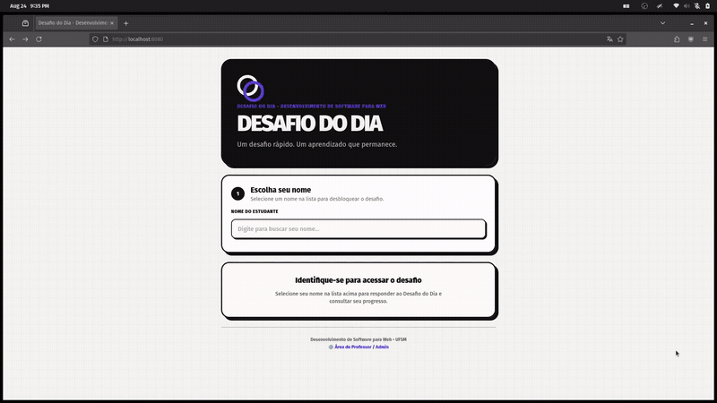

## Acesso

- [Aplicação em Produção (Railway)](https://project1-2026b-arthurmfroes-production.up.railway.app/)

## Desenvolvedor(a)
Arthur Moro
Sistemas de Informação

## App original

### Links

- Acesso: Não disponível no repositório original
- Repositório: [elc1090/demo-challenge-of-the-day](https://github.com/elc1090/demo-challenge-of-the-day)

### Descrição

Aplicação web simples para publicar desafios curtos e registrar respostas de estudantes. O frontend usa HTML, CSS e JavaScript sem frameworks; o backend usa Google Apps Script e Google Sheets.

## Demanda do(a) cliente

### Cliente
LAUREN AUTH LUGOCH

### Demanda
Pensei em quatro demandas principais como cliente:

1) ⁠Gostaria de adicionar um cronômetro para cada um dos desafios, com um tempo limite para o estudante enviar a resposta. E o tempo limite poderia ser definido junto com as outras informações do desafio, para que cada um tenha um tempo adequado ao seu nível de dificuldade. Quando o tempo acabar, deve aparecer uma mensagem avisando que não poderá mais enviar a resposta.

2) Quero que sejam adicionados mais desafios e que cada um seja associado a uma data específica. Também gostaria que os desafios pudessem ser separados por categorias ou assuntos, com uma etiqueta indicando a categoria e que seja exibida junto ao enunciado da questão.

3) Também gostaria de melhorar a interface da página quando não houver um desafio disponível para o dia. Em vez de deixar apenas a mensagem “Nenhum desafio disponível no momento” na área onde normalmente apareceria o desafio, gostaria que fosse apresentada uma interface específica para essa situação, informando também a data do próximo desafio disponível.

4) Gostaria que fosse adicionada uma área de desempenho do estudante, mostrando a quantidade de desafios que ele já respondeu, a quantidade de acertos e erros e sua porcentagem de acertos.

## Desenvolvimento

### Processo

Comecei clonando o repositório e rodando a aplicação, sinto que é mais fácil de assimilar as funções se começo pela visão prática do projeto. Tive problemas com o Google Sheets e já decidi que ele precisava ir. Depois fui, assistido por IA (usei os modelos da Google, da família Gemini), navegando pelo código pra entender como cada coisa se comunicava. Não me interessei muito em abrir os arquivos de interface, que sei que são relativamente simples.

Depois de entender bem o sistema e alinhar com as demandas, comecei a escrever as specs necessárias pra migrar do Google Sheets para um backend mais tradicional. O principal desafio foi a infraestrutura proposta pro trabalho. Fiz um brainstorm junto com a IA pra definir plataformas e abordagens que poderíamos usar, e cheguei à conclusão de que um container único, com a imagem hospedada em serviços gratuitos do GitHub, era o melhor caminho. A partir daí, foi um processo de tentativa e erro para alinhar as specs com o que foi solicitado pelo cliente e posteriormente hospedar a imagem. O processo de definição de specs e testagem foi mais longo que o desenvolvimento em si, dado que o código foi integralmente escrito por IA.

### Trechos de código

Indique pelo menos 3 trechos de código que você queira destacar para a turma (por exemplo, para contrastar com o código original, para explicar algo que aprendeu, para alertar sobre alguma dificuldade de compreensão, para mostrar uma curiosidade, etc).

##### Trecho 1

Uma das propostas do trabalho era automatizar o processo de release com GitHub Actions, porque eu não tenho familiaridade com ele. Nunca usei num projeto prático. Achei bem útil. Achei curiosa a maneira como o import de actions funciona, que é uma menção de actions publicadas no próprio GitHub.

 jobs:
      build-and-push:
        runs-on: ubuntu-latest
        permissions:
          contents: read
          packages: write
    
        steps:
          # 1. Clona o repositório na máquina temporária
          - name: Checkout Repository
            uses: actions/checkout@v4

          # 4. Faz login seguro no GitHub Container Registry usando o token da sessão
          - name: Log in to GitHub Container Registry (GHCR)
            uses: docker/login-action@v3
            with:
              registry: ghcr.io
              username: ${{ github.actor }}
              password: ${{ secrets.GITHUB_TOKEN }}

          # 5. Compila a imagem lendo o Dockerfile e faz o push para o GHCR
          - name: Build and Push Docker Image
            uses: docker/build-push-action@v6
            with:
              context: .
              file: ./Dockerfile
              push: true
              tags: ${{ steps.meta.outputs.tags }}
              cache-from: type=gha
              cache-to: type=gha,mode=max

Exemplo de action hospedada
[Login action](https://github.com/docker/login-action)

[Build and push to container registry](https://github.com/docker/build-push-action)

##### Trecho 2

Destaco o Docker porque é uma ferramenta que uso diariamente e é muito útil. Utilizamos nesse projeto porque o Railway lida muito bem com imagens Docker, é um deploy muito simples. A segunda razão é porque é uma ferramenta excelente em garantir consistência do código independente do ambiente. Docker é basicamente uma máquina virtual (ou container) que funciona só com as especificações dadas pelo arquivo de configuração. É um mini SO dedicado só para o app.

    # Baixamos apenas o node 22 numa instalação mínima de linux (alpine)
    FROM node:22-alpine AS builder
    WORKDIR /app

    # Pré-requisitos pro better-sqlite3
    RUN apk add --no-cache python3 make g++
    COPY backend/package.json backend/package-lock.json* ./backend/
    WORKDIR /app/backend
    RUN npm ci --only=production

    # Declara-se o comando também pra inicializar o servidor final
    EXPOSE 8080
    CMD ["node", "backend/src/server.js"]

  Com essa versão mínima pro programa, também fica rápido de subir no railway.

##### Trecho 3

No front-end, optamos por usar Alpine.js e Tailwind CSS importados direto via CDN. Sei que para projetos grandes de produção usar CDN não é a melhor das práticas. Remove toda uma etapa de configuração e complexidade desnecessária pra esse escopo.

Além disso, o Alpine.js melhorou muito a integração do JavaScript com o HTML. No código original, era preciso selecionar os elementos na mão via DOM, escutar eventos com addEventListener e manipular o HTML:

    // Como era antes (JS puro selecionando elemento do DOM e escutando clique):
    const suggestionsEl = document.querySelector("#student-suggestions");
    const studentInput = document.querySelector("#student-input");

    suggestionsEl.addEventListener("click", event => {
      const button = event.target.closest("button[data-student-id]");
      if (!button) return;
      
      const student = state.students.find(item => item.student_id === button.dataset.studentId);
      studentInput.value = student.display_name;
      suggestionsEl.innerHTML = "";
    });

  Com o Alpine não precisa buscar elemento nenhum no DOM, o clique e o estado são tratados de maneira praticamente unificada:

    <!-- Como ficou agora (importado via CDN e com bind direto na tag): -->
    

    <!-- O clique e o texto dinâmico ficam declarados direto no elemento -->
    <button 
      type="button" 
      @click="selectStudent(student)"
      x-text="student.display_name"
    >
    </button>

Achei bem mais legível e não é um framework pesado e complexo, como React, Vue, etc., então não é overkill.

## Tecnologias

### Linguagens e afins

- **HTML5 & CSS3**: Estrutura e semântica básica das páginas.
- **JavaScript (ES6+)**: Lógica tanto do cliente quanto do servidor.
- **Node.js (v22) & Express**: Backend em formato de API REST para servir os desafios, autenticação/validação do cronômetro e registro de respostas.
- **Better-SQLite3 / SQLite**: Banco de dados relacional embutido para persistência local de alunos, desafios e submissões sem dependência de serviços externos.
- **Alpine.js**: Framework reativo minimalista importado via CDN para manipulação de estado, reatividade e eventos na interface.
- **Tailwind CSS**: Framework CSS utilitário carregado via CDN para estilização visual rápida com design neo-brutalista.
- **Docker**: Conteinerização da aplicação através de builds multi-stage sobre imagem base Alpine Linux.
- **GitHub Actions & GHCR**: Pipeline de CI/CD para compilação e publicação automática da imagem no GitHub Container Registry.

### Ambiente de desenvolvimento

- **Editor / IDE**: VS Code (Visual Studio Code).
- **Sistema Operacional**: Linux.
- **Agentes de IA e Ferramentas**: Antigravity CLI (`agy`) utilizando modelos Gemini (Google) para planejamento de specs, geração de código e resolução de bugs.
- **Controle de Versão**: Git e GitHub.
- **Hospedagem & Nuvem**: Railway.

## Referências e créditos

- Repositório do app original da disciplina: [elc1090/demo-challenge-of-the-day](https://github.com/elc1090/demo-challenge-of-the-day)
- Documentação oficial do [Alpine.js](https://alpinejs.dev/)
- Documentação oficial do [Tailwind CSS](https://tailwindcss.com/)
- Documentação do [GitHub Actions](https://docs.github.com/en/actions) e [GitHub Packages (GHCR)](https://docs.github.com/en/packages)

---
Projeto entregue para a disciplina de [Desenvolvimento de Software para a Web](http://github.com/andreainfufsm/elc1090-2026b) em 2026b